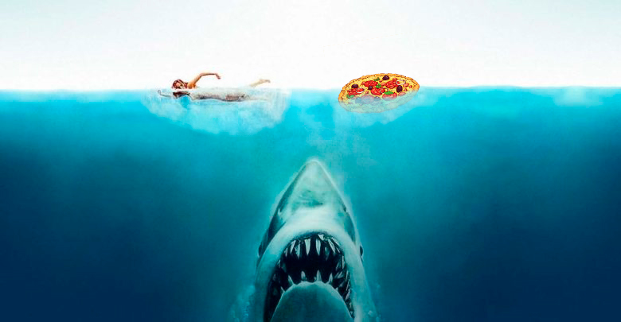

# Shark-Project

En el siguiente proyecto sobre pandas realizado en IronHack, podremos encontrar un analisis del documento Attacks del Shark Research Institute. https://www.sharks.org/global-shark-attack-file.

## Objetivo e hipótesis principal.

Tomo como objetivo principal de este proyecto la siguiente hipótesis : 

**"¿Pizza o pierna, que prefiere il tiburoni? El menu de los tiburones en Italia."** 

En el que tomaremos todos los ataques de tiburon en Italia y veremos si el tiburon ha preferido humano o de lo contrario, ha preferido no morder porque prefiere el famoso plato italiano. 

## Hipotesis secundaria. 

Aprovechando la limpieza de tablas y alguna función, he decidido crear una hipotesis secundaria para ver que parte del cuerpo es la preferida de los tiburones en el sur de Europa. A esta hipotesis la he denominado:

**"El plato preferido de los tiburones en el sur de Europa."**

